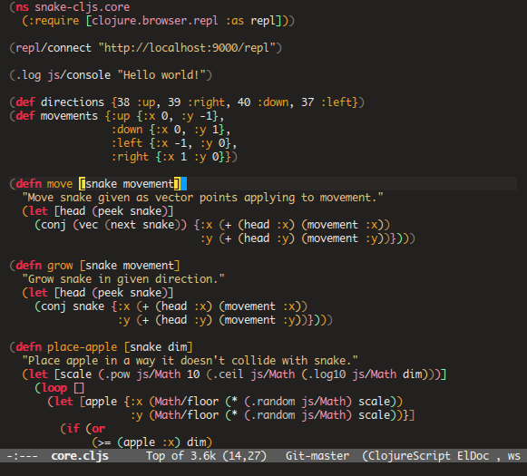
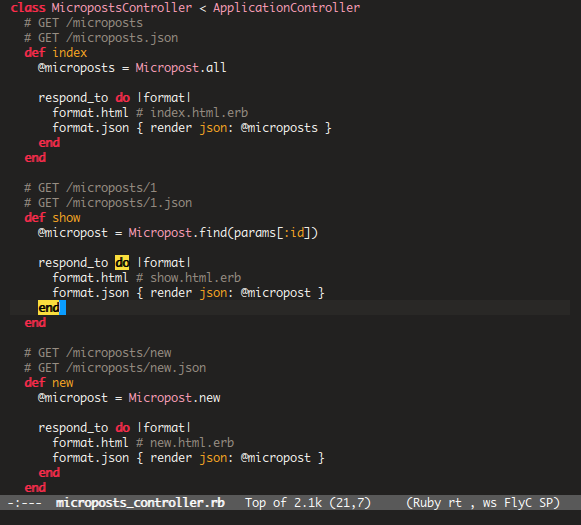

badwolf-emacs
=============

An Emacs port of [Bad Wolf](https://github.com/sjl/badwolf)
theme for Vim.

Installation
------------

Drop `badwolf-theme.el` in directory you specified on
`custom-theme-load-path` in your init file, for example:

```
(add-to-list 'custom-theme-load-path "~/.emacs.d/themes/")
```

Load theme on Emacs startup by adding this line to your init file:

```
(load-theme 'badwolf t)
```

or load it interactively:

```
M-x load-theme RET badwolf
```

Screenshots
-----------

### Clojurescript



### Ruby



Contributing
------------

Feel free to send pull request if you want your favourite mode
supported.